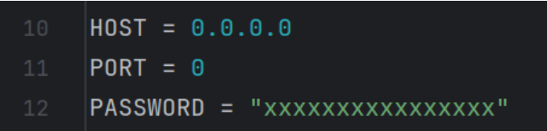

# Game Monitor

# Game Monitor - record screen, keyboard, and mouse movements at the same time

### How to use

1. Install OBS studio if you don't have one.

2. Open OBS webserver settings
   
   
   

3. Enable OBS webserver
   

4. Check "Display connections settings" and write your host, port and password into the default params of `obs.py`
   
   
   

5. Create a scene called "screen" and configure its source as screen capture
   

6. Right click the OBS monitor and select "Window Projection" to enable correct full-screen capturing.
   

7. You are all done! Before you start your game, run `obs.py` in your IDE or `python obs.py` in terminal to start capturing. Videos will be stored in ./recordings, mouse and keyboard logs will be stored in the same directory as obs.py.

