# Game Monitor

### How to use

1. Install OBS studio **30.1.0** if you don't have one. Make sure the version is 30.1.0. This application is not guaranteed to fit for other versions.

2. Open OBS webserver settings
   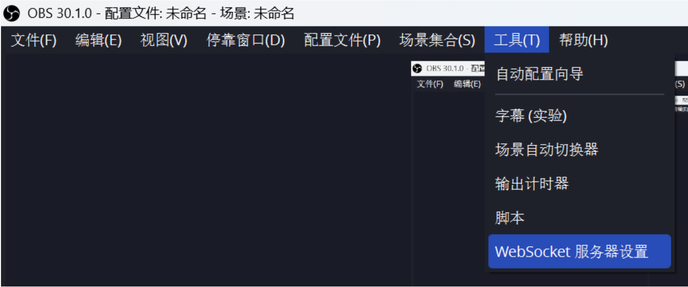
   
3. Enable OBS webserver
   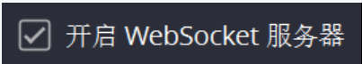

4. Check "Display connections settings" for your host, port and password (modify first if you wish). Copy these information into the upper part of the game monitor panel.
   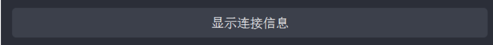
   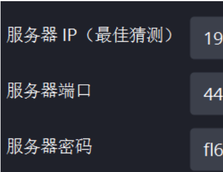
   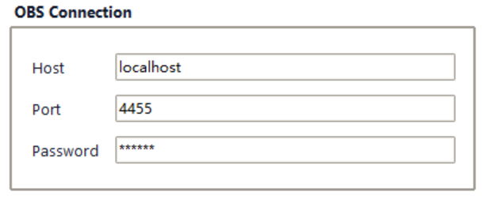

5. Create a scene called "screen" (or any name you want, but make sure the name is consistent with the settings in step 6) and configure its source as screen capture. Double-check if the screen capture is enabled or you will record an empty dark screen.
   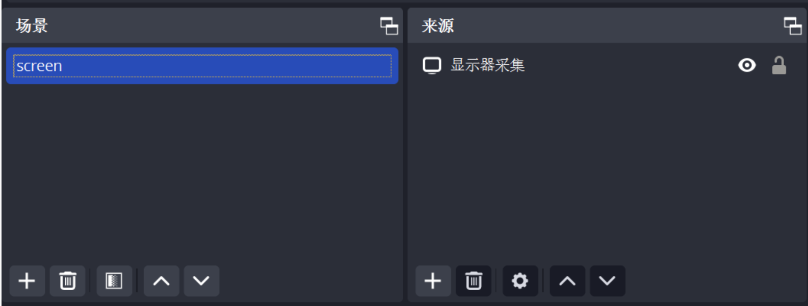

6. Input the scene name and select the folder where the application would save your video and action records. Make sure you are selecting a disk that has enough space left, as the videos can be quite large under default settings (4-5GB per hour)
   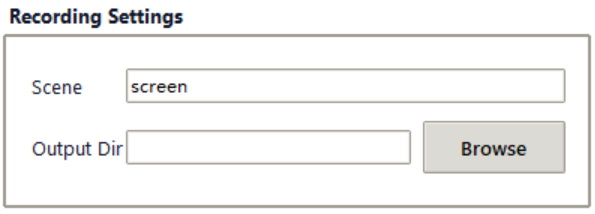

7. **First left click the upper part (recording preview screen) of the obs panel. (should have a red edge if selected)** Then right click the same part (the preview screen) and select "Render as source resolution" (使用此源的尺寸作为输出分辨率) to enable correct full-screen capturing.
   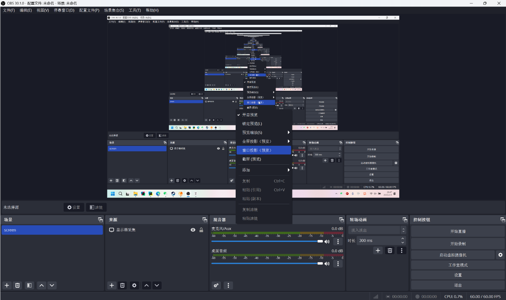

8. Set video format to mkv, video encoder to NVIDIA NVENC HEVC, bitrate to 8000 Kbps, fps to 30
   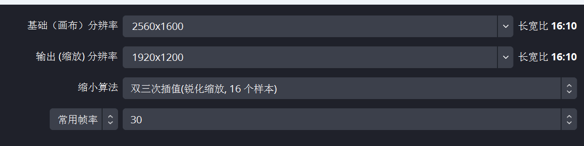
   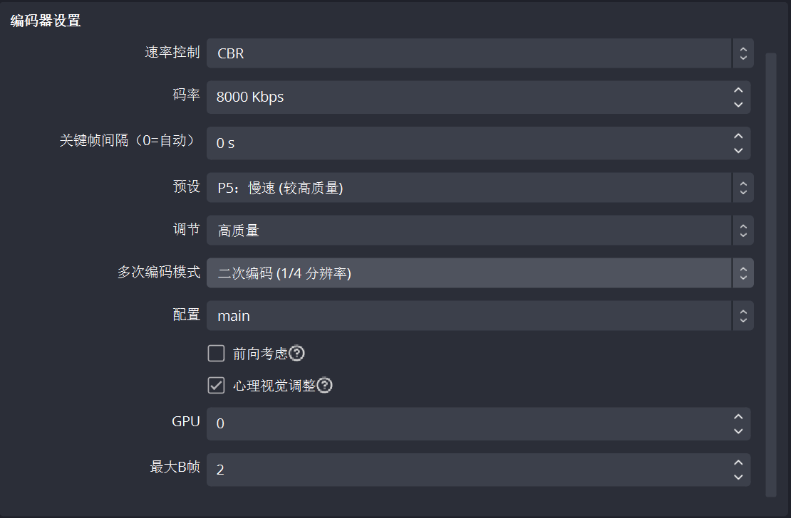
   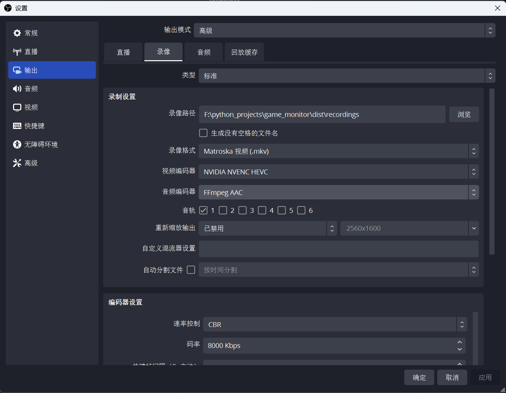

9. You are all done! Before you start your game, **make sure obs is running in the background**, and click the blue 'start recording' button to start capturing. This will automatically start the obs. A red dot will appear on the obs icon if the setup is successful. The red 'stop recording' button stops all recordings, including the obs.

